# 小白向小爱破解教程

## 最后警告！

禁止在我们的任何一个平台（包括 QQ 群、TG 群、论坛、聊天应用）询问 **已经在本教程或公共文档中写明解决方法的问题** ，否则一律警告或高强度 diss。

不要相信 QQ 的网站安全提示，我们不打算盗走你的账号，因为没什么卵用。

QQ 报网站不安全是因为我们猎杀了腾讯的亲妈。

## 视频教程地址

**还是没有底的小白可以去看 [视频教程](https://od.misaliu.top/Files/%E5%B0%8F%E7%88%B1%E8%80%81%E5%B8%88/%E5%B0%8F%E7%88%B1%E7%A0%B4%E8%A7%A3%E8%A7%86%E9%A2%91%E6%95%99%E7%A8%8Bv1.0_%E5%B0%8F%E7%99%BD%E4%B8%93%E7%89%88.mp4?preview) [百度网盘链接（提取码 miai）](https://pan.baidu.com/s/1gjBgBNn3TKbiWaQqtzfjJA?pwd=miai) [阿里网盘链接（提取码 82uk）](https://www.aliyundrive.com/s/3KaqPQWieEk)**   
**还是没有底的小白可以去看 [视频教程](https://od.misaliu.top/Files/%E5%B0%8F%E7%88%B1%E8%80%81%E5%B8%88/%E5%B0%8F%E7%88%B1%E7%A0%B4%E8%A7%A3%E8%A7%86%E9%A2%91%E6%95%99%E7%A8%8Bv1.0_%E5%B0%8F%E7%99%BD%E4%B8%93%E7%89%88.mp4?preview) [百度网盘链接（提取码 miai）](https://pan.baidu.com/s/1gjBgBNn3TKbiWaQqtzfjJA?pwd=miai) [阿里网盘链接（提取码 82uk）](https://www.aliyundrive.com/s/3KaqPQWieEk)**   
**还是没有底的小白可以去看 [视频教程](https://od.misaliu.top/Files/%E5%B0%8F%E7%88%B1%E8%80%81%E5%B8%88/%E5%B0%8F%E7%88%B1%E7%A0%B4%E8%A7%A3%E8%A7%86%E9%A2%91%E6%95%99%E7%A8%8Bv1.0_%E5%B0%8F%E7%99%BD%E4%B8%93%E7%89%88.mp4?preview) [百度网盘链接（提取码 miai）](https://pan.baidu.com/s/1gjBgBNn3TKbiWaQqtzfjJA?pwd=miai) [阿里网盘链接（提取码 82uk）](https://www.aliyundrive.com/s/3KaqPQWieEk)**

**注意：视频教程仅为文字教程的补充，视频教程后续不会有任何更新，如果视频教程的操作或提示与文字教程有冲突，请以文字教程为准。**   
**注意：视频教程仅为文字教程的补充，视频教程后续不会有任何更新，如果视频教程的操作或提示与文字教程有冲突，请以文字教程为准。**   
**注意：视频教程仅为文字教程的补充，视频教程后续不会有任何更新，如果视频教程的操作或提示与文字教程有冲突，请以文字教程为准。**

## 0. 准备工作

你需要准备的是：

* 已经下载好的小爱老师破解包
* 一台 Windows 10 及以上的电脑
* 一个能正常思考的脑子
* 一双能阅读文字和寻找图像的眼睛
* 一双能正常活动的手
* 掌握电脑的基本操作水平，包括解压文件、安装软件、运行程序等
* 能看懂英文，或能使用翻译器，且能理解其想表达的意思
* 懂得如何向互联网求助 __（非常重要！）__

破解包目前的最新版本是 `v1.2.2`，如果你在破解包中的 `ReadMe` 文档中看到的版本与此不符或没有版本号，请前往 QQ 群 `635236749` 下载最新的破解包。

请注意，未知来源的破解包可能包含意料之外的行为（如恶意脚本等），请确保您使用的破解包来自上述 QQ 群。

破解包的解压密码是 `midrai.cn`。

然后，将小爱老师破解包解压出来，放在一个你知道的地方。可以在桌面新建文件夹，然后把解压出来的东西都放进去。注意路径不要包含空格，可能会出现玄学问题。

下文中，我们将会把你的这个文件夹称做 `小爱老师破解包` 或 `破解包`。

## 1. 安装必要环境

### 1.1. 安装 Python

进入小爱老师破解包，双击运行 `[64位]安装Python` 文件。如果这个文件打不开或者打开报错请尝试 `[32位]安装Python` 文件。

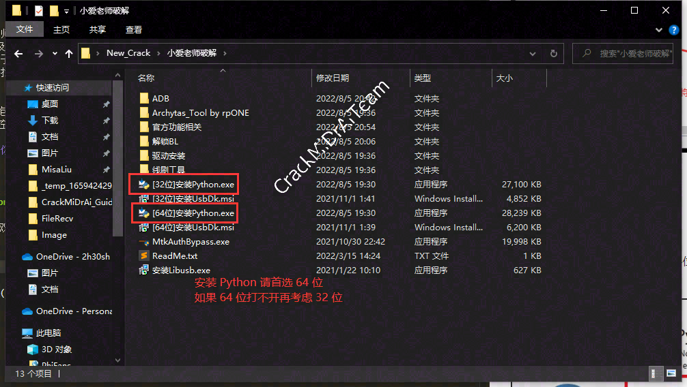

然后在弹出的安装页面中，勾选 `Add Python 3.11 to PATH`，确认勾选无误后点击 `Install now` 即开始安装。

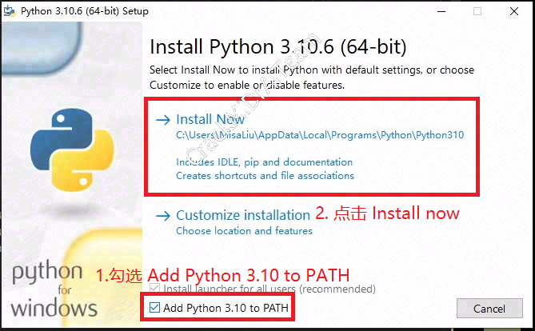

安装完成后会出现如下页面，直接单击 `Close` 关闭窗口即可。

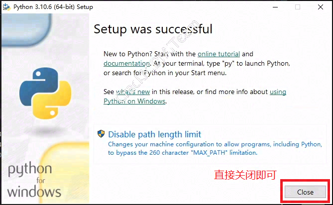

如果你不确定 Python 是否真的安装成功，可以右键任务栏上的 Windows 图标，在弹出的菜单中选择 `Windows PowerShell(I)`，然后在弹出的窗口中输入 `python -V` 并回车。如果能正常返回 `python 3.x.x` 即是 Python 安装成功，否则请向互联网求助。

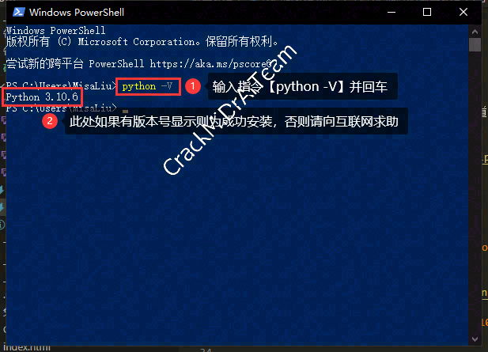

### 1.2. 安装 UsbDk

和安装 Python 一样，双击运行 `[64位]安装UsbDk`。如果不能打开请尝试 `[32位]安装UsbDk`。

安装完成后 UsbDk 的安装窗口会直接自行关闭，这是正常现象。

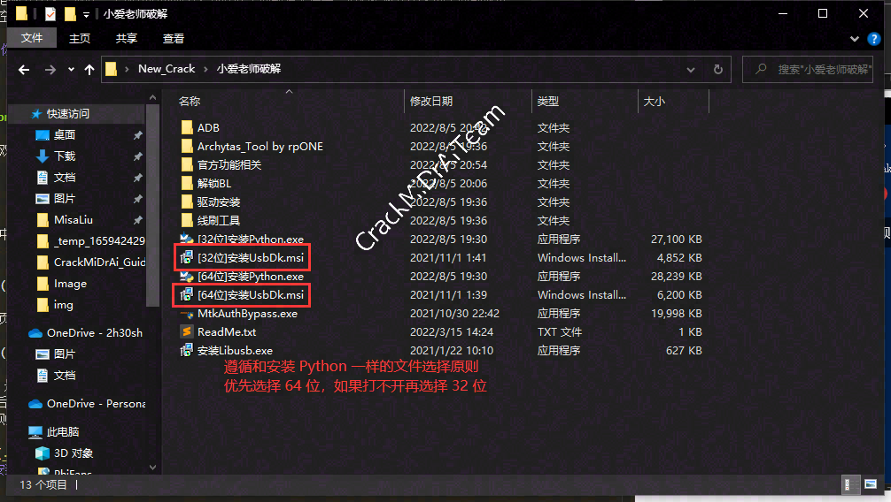

### 1.3. 安装 MTK 驱动

打开 `驱动安装` 文件夹，双击运行 `!!运行我安装驱动`，然后根据提示一步步来即可。

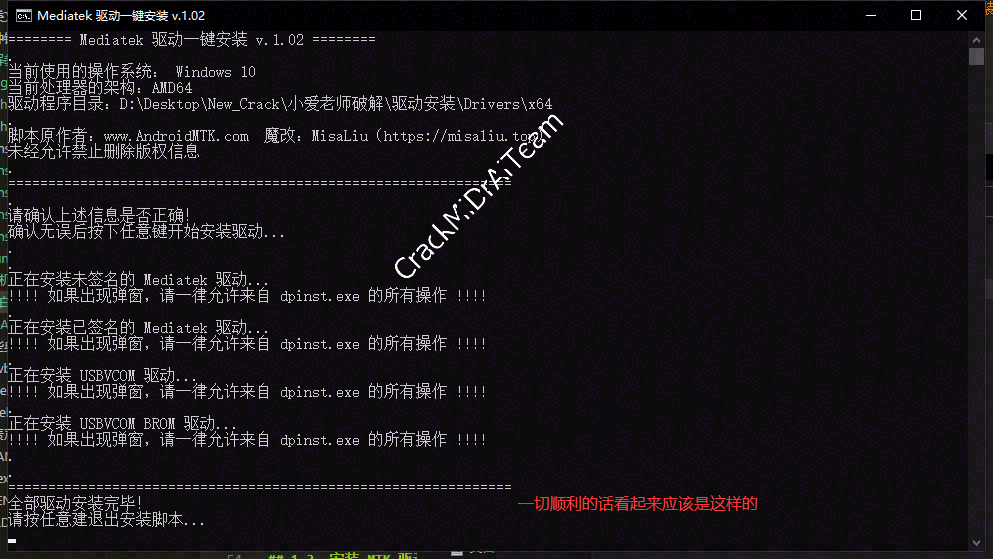

### 1.4. 安装 libusb

回到破解包根目录，打开 `安装Libusb`，根据提示一步步往下走即可。

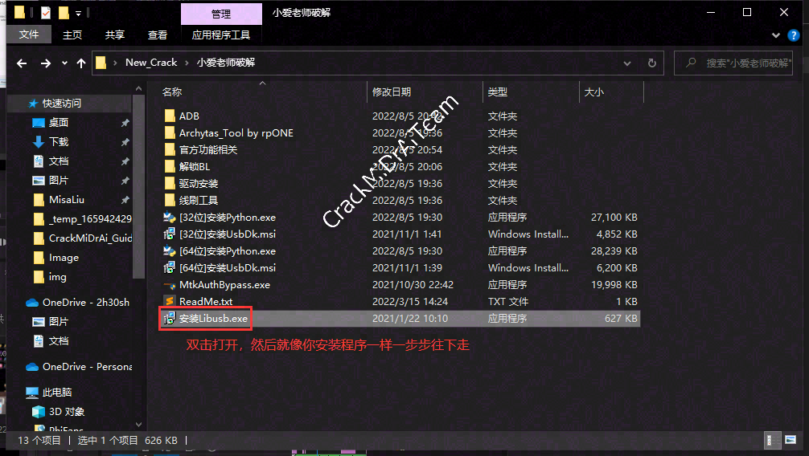

当 libusb 安装接近尾声时，确保窗口中 `Launch filter installer wizard` 是勾选的状态，然后点击 `Finish` 结束安装并启动 libusb。

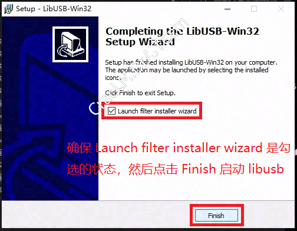

## 2. 为小爱安装 libusb 驱动

这一步比较吃手速，希望你能赶上来。

在上一步的 libusb 弹出的窗口中选择 `Install a device filter`，然后点击 `Next` 进入设备选择页面。

此时拿起你的小爱，将其关机，然后 **在按住音量下键插线的情况下和电脑相连**。此时 libusb 的设备列表大概率会闪过一个设备（设备的名字可以对照下面的列表），快速地选中它，然后单击 `Install` 按钮安装驱动。如果 libusb 没有任何报错即是安装成功。

关于这个设备名称的几种可能，你可以参考这个列表：

* `MTK VCOM PORT`
* `USB Port`
* `MT65XX Preloader`
* `Preloader USB VCOM`

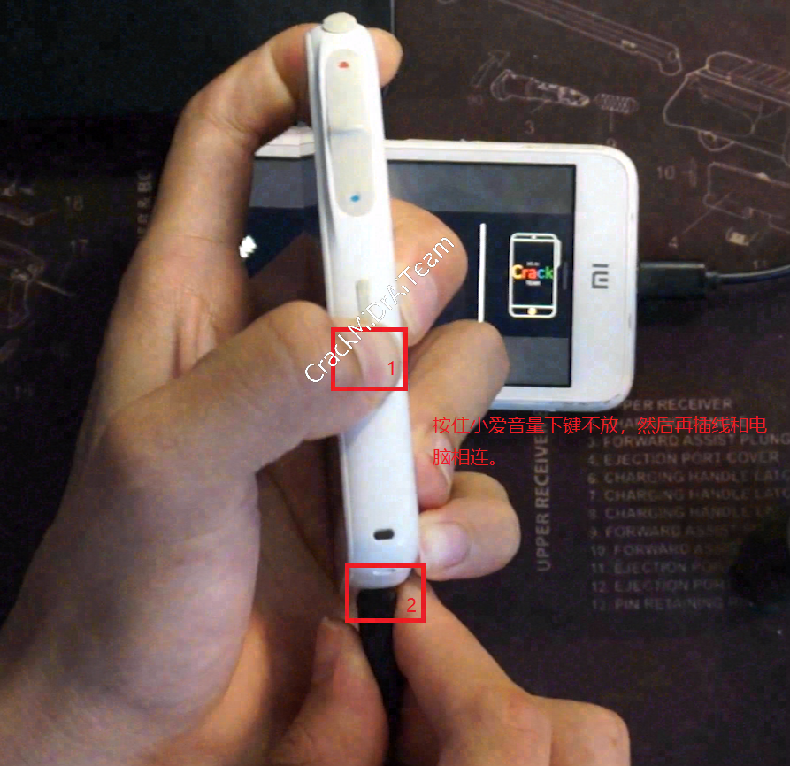
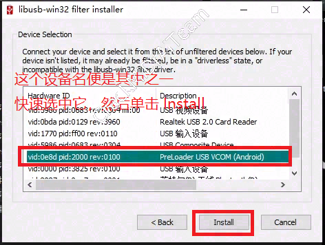
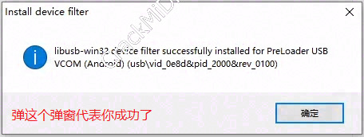

安装成功会弹出类似上图中的弹窗，此时便可关闭 libusb 并将小爱和电脑暂时断开连接。

如果没有出现类似上图中的弹窗，那么请截图弹窗内容并向互联网求助。

## 3. 为小爱强制解锁 BL（可选）

> 注：在某次实验下，我们发现解锁 BL 与否都不会影响到接下来的步骤，因此从此版本的教程开始，解锁 BL 将变为可选项。
> 
> 如果你后续需要进行一些操作，例如扩容 /system 分区，那么推荐现在就解锁 BL。

**注意：解锁 BL 会清空您设备的所有数据，请在解锁 BL 前备份您所有的重要数据。**

**不要依赖小米云备份，某些数据（如照片和录音）不会被云备份。**

回到破解包，进入 `解锁BL` 文件夹，双击运行里面的 `!!安装依赖` 脚本以安装必要的依赖。如果安装脚本没有输出任何以 `error` 为字眼的内容即代表安装成功，否则请截图向互联网求助。

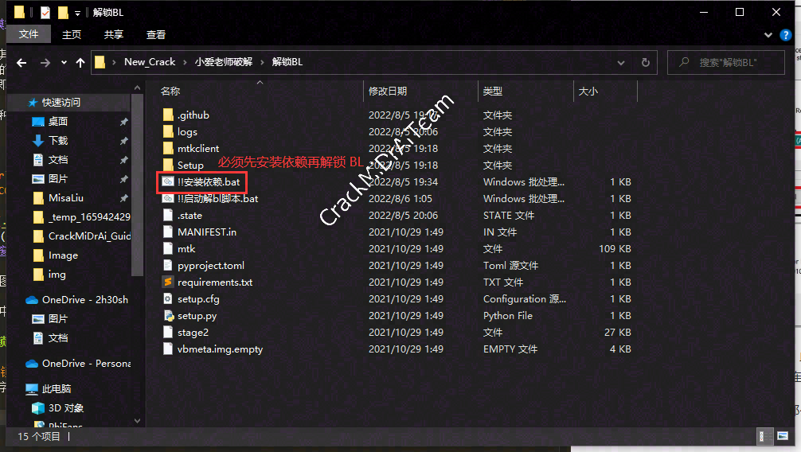
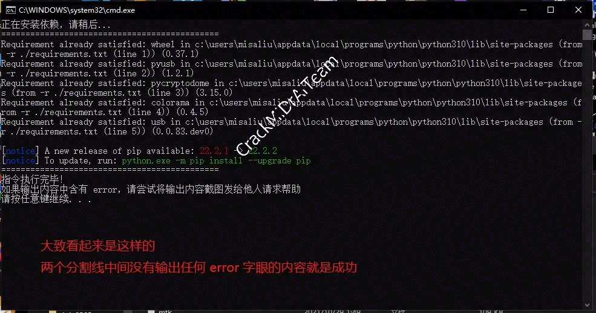

依赖安装成功后，运行 `!!启动解bl脚本` 进行解 BL 操作。

脚本运行后请按照刚才安装 libusb 的方法连接小爱和电脑，脚本应该会自行检测到设备并开始尝试解锁 BL。

最后的输出内容如果有 `Success` 字眼便是成功（这里我忘记截图了），否则请截图向互联网求助。

当然，你可以给小爱开机，如果开机时出现 `dm-verify error` 和 `orange state` 则证明 BL 解锁成功。

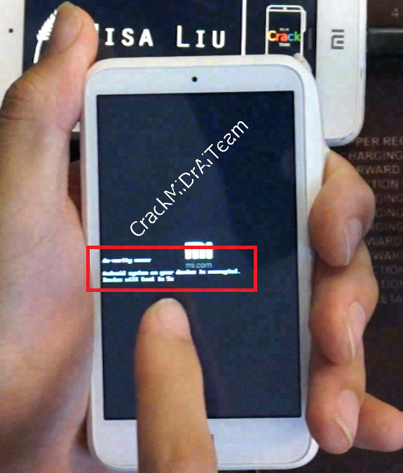

## 4. 为小爱进行 bypass 操作

回到破解包，双击运行 `MtkAuthBypass`，在弹出的窗口中点击 `Disable Auth` 并备用。

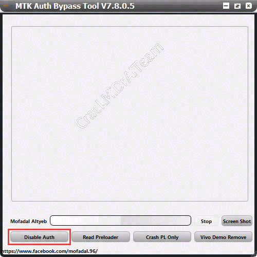

然后将小爱和电脑再次使用刚才 libusb 的方法连接，此时程序应该会自行检测到设备并开始尝试 bypass。如果最后的输出内容中含有 `now you can use SP Flash Tool or any MTK Tool` 则意味着 bypass 成功，即可关闭 bypass 程序，否则请截图向互联网求助。

另请注意，**不要断开小爱和电脑的连接！** 如果你不小心断开了，那么请将小爱开机再关机，然后重新 bypass 即可。

*\* 据有些人反馈，使用 `MtkAuthBypass` 可能会导致电脑蓝屏或者遇上其他的奇怪情况。如果你出现了这样的问题，可以尝试使用 `mtkclient-gui` 代替 `MtkAuthBypass`。*

## 5. 为小爱刷入 TWRP

回到破解包，进入 `线刷工具` 文件夹，然后打开 `!!运行我启动线刷工具`。初次启动的时候可能会有一个弹窗，直接关掉即可。

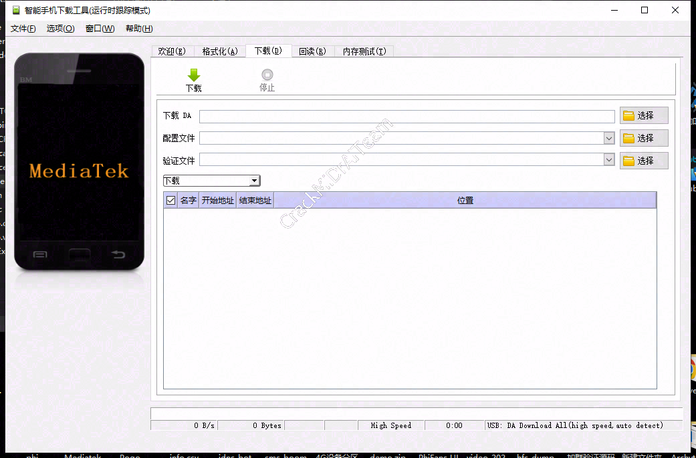

然后单击 `下载 DA` 一栏中的 `选择` 按钮，选择 `MTK_AllInOne_DA` 文件。

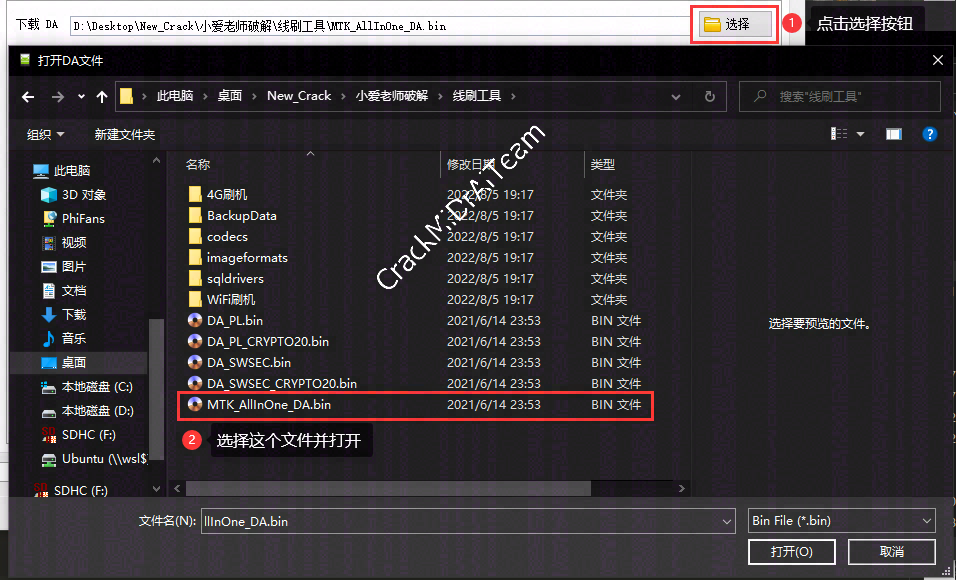

接下来单击 `配置文件` 一栏的 `选择` 按钮，根据你的机型选择 `4G刷机` 或者 `WiFi刷机` 文件夹，然后选择对应文件夹内的 `MT6761_Android_scatter` 文件。**请注意一定要按照对应机型选择对应文件夹，否则可能会出问题。**

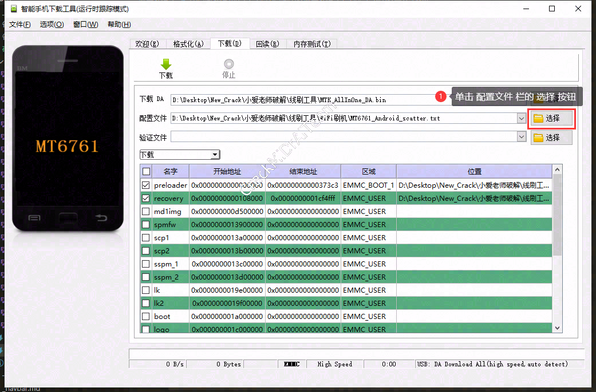

如果这些操作下来，你的线刷工具已经可以显示分区列表即为成功，否则请向互联网求助。

接下来点击线刷工具的 `下载按钮`，等待刷机工具读完条，出现绿色对勾便是刷入成功。如果不是绿色对勾或者是报错弹窗，请截图并向互联网求助。

刷入完成后断开小爱和电脑的连接，按下 `电源键+复读键+语音红键+音量上键` 尝试进入 TWRP,如果亮屏时先显示一行 `Entering recovery...` 即代表操作正确可以松手等小爱进入 TWRP 了，如果没有请一定要按住电源键然后再多试几次（按住电源键是为了防止进系统）。

如果你不幸进了系统，那么请从 [4. 为小爱进行 bypass 操作](#/破解教程/小白向教程?id=_4-为小爱进行-bypass-操作) 这步开始重来。

## 6. 相关善后

### 6.1. 格式化 Data 并恢复出厂设置

进入 TWRP 后先不要着急，先滑动滑块允许修改 System，然后到 `清除` 页面，将滑块滑到低以格式化 Data 并恢复出厂设置 *（如果提示失败可跳过）* ，然后重启进系统即可。

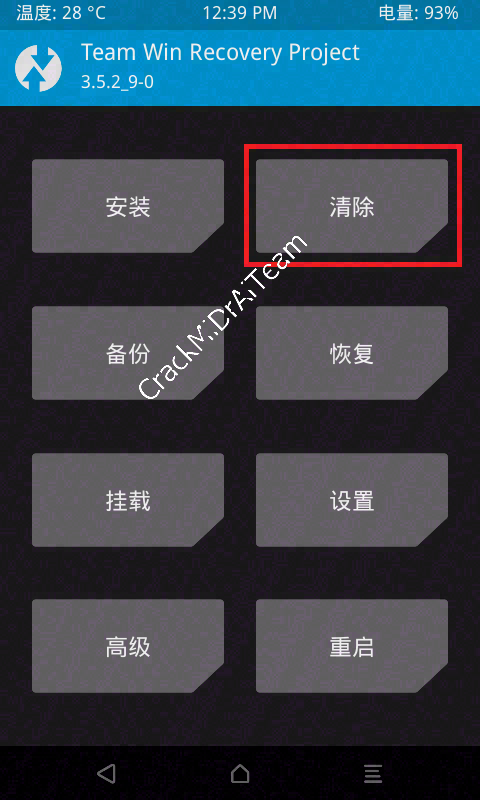
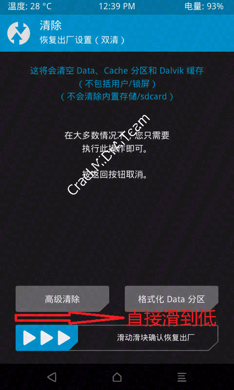

### 6.2. 对小爱进行必要的修改

重启进系统之后先将欢迎界面过掉（这里就不放图了）然后再次将小爱关机进入 TWRP，还是滑块允许修改 System 分区。然后进入 `挂载` 页面，将 System 一栏打勾（点击一下即可）以挂载 System 分区。

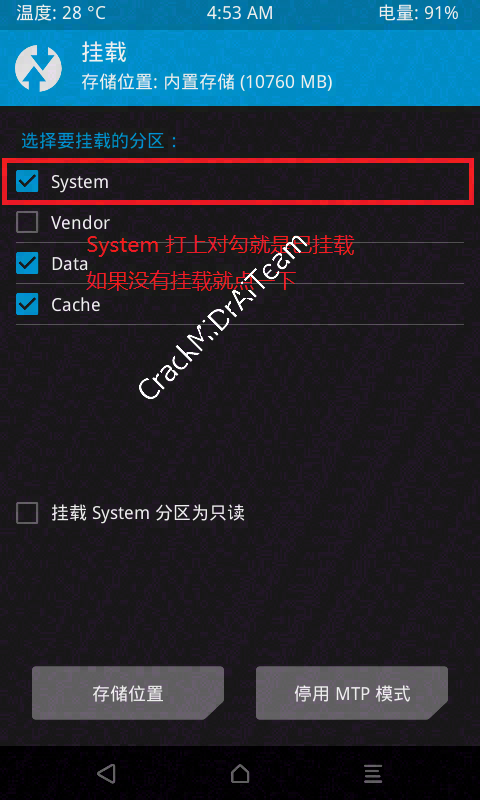

然后将小爱和电脑直接相连，回到破解包，进入 `Archytas_Tool by rpONE` 文件夹，运行 `!!运行我` 程序，如一切正常你将看到 Archytas tool 的主页面，否则请检查小爱和电脑的连接或是向互联网求助。

这里推荐使用的配置是：`ADEFI`，如果你需要使用原厂功能请加上 `C`，如果你需要使用 Magisk 请加上 `K` 并根据程序提示使用。

输入完毕后按下回车，等待提示 `执行完成，您是否需要再次执行？（y/n）` 后输入 `n` 并按下回车退出 Archytas tool。如果在提示之前有任何报错，请截图向互联网求助。

然后回到破解包根目录，进入 `ADB` 文件夹，双击运行 `!!打开cmd` 以启动命令行窗口。

在命令行中，输入 `adb push ./es.apk /system/priv-app` 后回车以将 ES 文件管理器推送为系统应用（没有图）。

完成这一切之后就可以重启进系统了。在 TWRP 主页选择 `重启`，然后选择 `系统` 即可（也没有图）。

### 6.3. 还原官方功能（可选）

官方功能有些人喜欢有些人觉得鸡肋，而且保留官方功能会肉眼可见地增加运存和存储占用，所以还不还原官方功能取决于你的想法。

首先你需要让小爱和你的电脑连接在同一网络环境下，然后在你的小爱中启动 ES 文件管理器，然后在左上角菜单中找到 `网络` 分类，再在该分类下寻找 `远程管理器` 功能。在接下来的页面中，点击 `打开` 启动远程管理器。

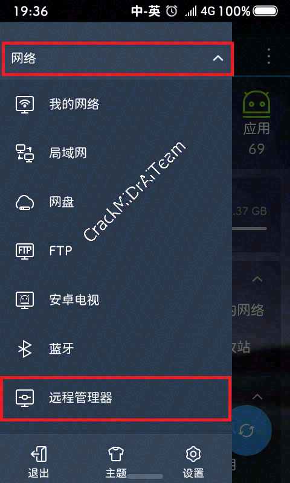

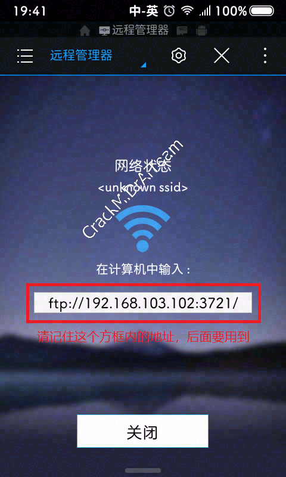

启动远程管理器后，请记住白色方框内的地址。在电脑上打开 `此电脑`，然后在地址栏内输入这个地址，按下回车，即可进入 ES 远程文件管理器。

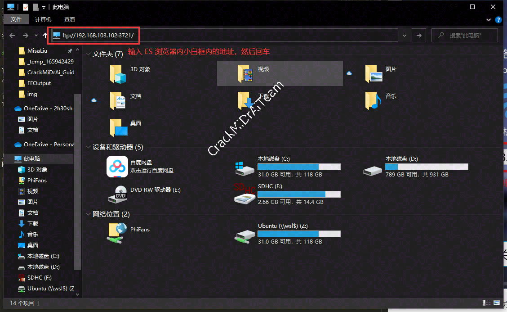

然后回到破解包，将 `官方功能相关` 文件夹内的三个安装包全部复制进小爱内。可能会花上较长时间，请耐心等待。文件传输期间请勿让小爱息屏。

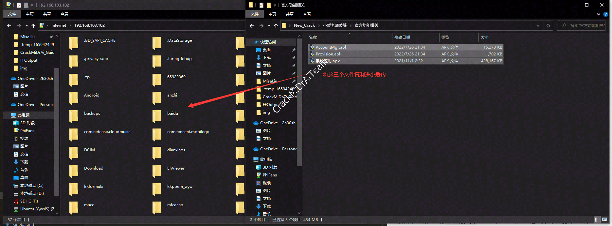

复制完成后回到小爱，直接安装刚才复制进去的三个安装包。如果提示禁止安装，按照提示开启权限即可（没有图）。

此时你回到主页使用官方功能大概率会卡初始化。确保你在 [6.2. 对小爱进行必要的修改](#/破解教程/小白向教程?id=_62-对小爱进行必要的修改) 中启用了系统更新，然后进入 `设置`，进入 `检查更新`，点击 `检查更新` 按钮以让系统自行安装所需的依赖库，安装完毕后即可正常使用。**如果提示要求更新系统，请一定不要更新！会造成设备卡在 TWRP，只有刷救砖包才可恢复。** 如果你一切处理完毕，可以使用 `Archytas tool` 将系统更新禁用。（没有图）

## 结束

到这里你的小爱就已经破解完毕了，恭喜你！

有关任何小爱老师的玩机资源/技巧/交流讨论，欢迎加入我们：

* 官方网站： https://midrai.cn
* 官方论坛： https://bbs.midrai.cn
* 官方 QQ 群：476558670

CrackMiDrAiTeam 2021-2022 版权所有，禁止以任何形式进行未经授权的转载

本系列资源免费在互联网上提供，如果您是付费获取的本资源，请马上尝试退款举报并不遗余力地举报 TA！
